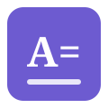

= リンク・画像・相互参照・脚注
:author: AsciiDoc Editor
:toc:

== リンク

* 自動リンク: https://asciidoctor.org
* テキスト付きリンク: link:https://asciidoctor.org[Asciidoctor 公式サイト]
* メールリンク: mailto:example@example.com[お問い合わせ]

== 画像

画像は文書からの相対パスで指定します。

インライン画像も使えます:  のように文中に配置できます。

NOTE: 外部 URL の画像(`+image::https://...+`)も記法としては有効ですが、
このアプリではセキュリティ設定(CSP)により表示されません。

== 相互参照(クロスリファレンス)

見出しにアンカーを付けておくと、文書内の別の場所から参照できます。

[[sec-conclusion]]
== まとめの節

この節は `<<sec-conclusion>>` で参照できます。

参照例: 詳しくは <<sec-conclusion,まとめの節>> を参照してください。

インラインアンカー [[custom-anchor]] を置いて、`<<custom-anchor>>` のように参照することもできます。

== 脚注

本文中に脚注footnote:[これは脚注の内容です。]を挿入できます。

同じ脚注を複数回参照することもできますfootnote:note1[共有される脚注の内容]。
再度参照footnote:note1[]。
